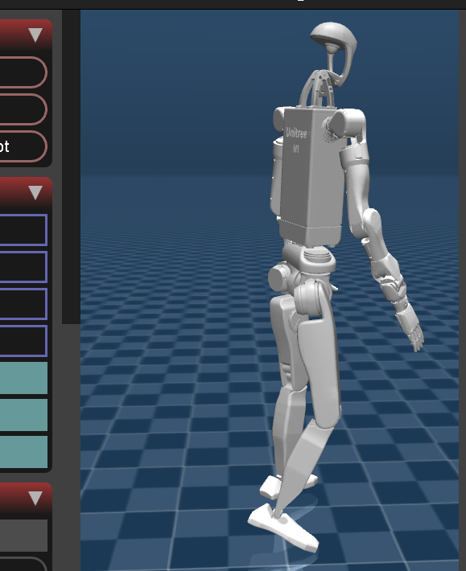

# Unitree H1 MuJoCo RL Environment



## Overview
This project implements a **Reinforcement Learning (RL)** environment for the Unitree H1 Humanoid Robot using **MuJoCo** physics and **Gymnasium**. The goal is to train the robot to imitate human walking motions using the **PPO (Proximal Policy Optimization)** algorithm.

## System Architecture

```mermaid
graph TD
    A[Motion Asset (LAFAN1 CSV)] -->|Load & Retarget| B(H1Env - Gymnasium);
    B -->|Physics Steps| C{MuJoCo Engine};
    C -->|State (Joint Pos/Vel)| B;
    B -->|Observation + Reward| D[PPO Agent (Stable-Baselines3)];
    D -->|Action (Torques)| B;
    B -->|Control| C;
```

## Features
- **High-Fidelity Physics**: Uses MuJoCo for accurate dynamic simulation.
- **Imitation Learning**: Rewards the agent for tracking a reference motion (`walk1_subject1.csv`).
- **Reference State Initialization (RSI)**: Randomly spawns the robot at different points in the walking cycle to accelerate learning.
- **Physics Stabilization**:
    - **Collision Filtering**: Self-collision between robot parts is disabled to prevent physics explosions.
    - **Hand Actuation**: Hand motors are disabled for the walking task to prevent high-frequency noise instability.

## Installation

Ensure you have Python 3.8+ and install the dependencies:

```bash
pip install mujoco gymnasium stable-baselines3 numpy<2
```

## Usage

### 1. Visualization (Optional)
To see the robot move kinematically (ignoring physics) and verify the motion data:
```bash
python3 h1_mujoco/play_motion.py
```

### 2. Training
To start training the PPO agent. This runs "headless" (no window) for maximum speed.
```bash
python3 h1_mujoco/train_ppo.py
```
- **Checkpoints** are saved to `./h1_checkpoints/` every 10,000 steps.
- **Logs** usually show `ep_len_mean`. Ideally, this should increase as the robot learns to balance.

### 3. Watching the Agent
To visualize the training progress, load the latest checkpoint:
```bash
python3 h1_mujoco/watch_agent.py
```
This opens a MuJoCo viewer where you can see the robot attempting to walk.

## Troubleshooting

### "The Robot Falls Immediately"
This is normal at the start of training! The policy is initialized with random noise. It takes time (millions of steps) to discover a standing policy.

### "The Robot Explodes / Disappears"
If you modify `h1_env.py` or re-enable collisions, you might see "NaN" errors. The current configuration disables **Robot-Self-Collision** and **Hand Acutation** to ensure stability.

### "The Robot Spawns in Different Poses"
This is **RSI (Reference State Initialization)**. It is a feature, not a bug. It helps the robot learn "how to recover" or "how to continue walking" from any phase of the gait.
